# Using the PLM web client

## Introduction

This guide is written for CAxMan application and tools developers to assist them how to use PLM concepts in their services and workflows.

## Why use PLM

PLM provides, in a product-structure-based way, management of system, product and project data. Management of data means, among others, controlled sharing and integration of data as they emerge during a system/product/project life-cycle, and long-term archiving. Such data shall be exposed through a PLM Server to other users. Besides the data themselves, also meta data are made available that describe who created or modified the data, when, how and for what purpose. Also version and configuration data are such meta data.
The remainder of this document refers to these three types of data, system, product and project data, as just “product data”.

### Configuration control

The PLM Server enables configuration control of the different versions of a product structure and of the data related to it. For this, the PLM Server provides, among others, the following functionality:
- Create folder versions
- Create baselines
- Create folder versions of folders belonging to a baseline
- Copy a folder version to another parent
- Assign editors and readers to folder versions
- Link versions of different folders to one another
- Remove folder versions.

### Persistence and traceability

PLM data is always related to the product structure tree, and is presented in such a tree structure.

<p align="center">
  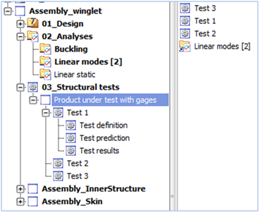
</p>

The PLM Server allows you to store - in such tree - product data that are in parameters or that are in files, including documents, software, manuals, structured documents like STEP, etc.
Versioning of folders in the product structure allows the history of the product data to be tracked throughout the development of the product.

### Export and archival

Data in the PLM Server will represent a rather comprehensive product description after having been collected over a period of time. For products with a long lifetime it is worthwhile to archive this data set. The PLM Server offers archiving capabilities in a standard representation (ISO 10303-209) for long term storage.

## Roles of PLM in CAxMan workflows

PLM functionality is available in CAxMan – and else – as web-services and through a web-client.
The web-client user’s guide is in [User guide PLM client](./utilities_plm_webclient.md#user-guide-plm-client). The PLM web-client can act as a service within a CAxMan workflow to hand-over files to subsequent services. The invocation of the web-client as part of a CAxMan workflow is described in [this document](./utilities_plm_webclient.md#integrating-the-plm-web-client-in-a-workflow).

Access to the PLM Server via web-services is twofold:
1.	[Via GSS](../service_implementation/advanced_plm.md#gss).
1.	[Via EDMopenSimDM native web-services](../service_implementation/advanced_plm.md#native-services--soap-).

These two types of services give you access to, among others, the following functions:
- Creation and management of version-controlled files and folders. (partially in GSS)
- Storage of product data in a user-defined folder structure that may reflect the life-cycle stages of the product. (file upload in GSS)
- Access control for users and applications, particularly for applications operating within workflows. (Native)
- Approval of version-controlled information. (Native)
- Versioning of folders. (GSS)
- Storage of parameter values in folders. (Native)
- Storage of feedback comments in folders. (Native)
- Approval of folder versions. (Native)

## User guide PLM client

The PLM web client can be directly accessed by the following URL:
https://caxman.clesgo.net/jotne/STM_web/

In case of direct access (not via workdlow) sign-in is required. The user name is the one you use for the Portal. If you do not have a specific password for the PLM Server, request one by sending an e-mail to caxman@jotne.com .

### List of models

If the PLM web client is launched from a workflow, no extra sign-in is required. The workflow passes a session token to the PLM web client.
After havingbeen launched the PLM client presents the list of available repositories and models in the left-hand side panel. An example of available product structures is shown below.
The example only shows one repository *InitialRepository* and with a single product structure (model) *Ultralight_Glider* in it.

<p align="center">
  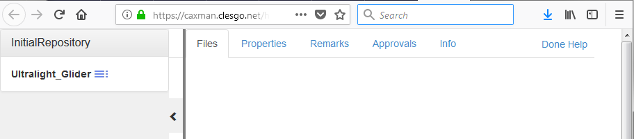
</p>

Click  icon near the model name of your interest, and a context menu with the single item "Open" will appear.

<p align="center">
  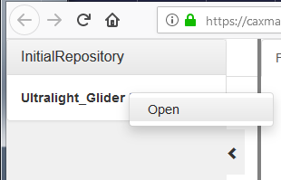
</p>

### Product structure and meta-data

The product structure of a model will be shown on the left side of the web page where repositories and projects were listed before.
The panel with repositories and models is collapsed to the left; it can be shown again by clicking on the arrow icon (right angular bracket).

<p align="center">
  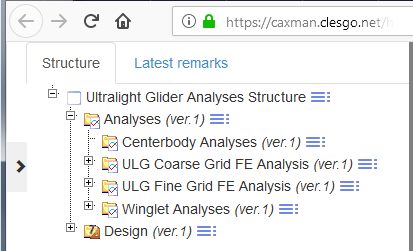
</p>

Children nodes are shown (expanded) by clicking on the plus sign or by clicking on the node name.
Meta-data of a product structure node is opened from the left panel by clicking the  icon and selecting the "Open" menu item from the context menu. The result is depicted in the following picture.
By default, the tab "Files" is selected from the tabs of the right-hand side panel. There files attached to the selected folder are listed.

<p align="center">
  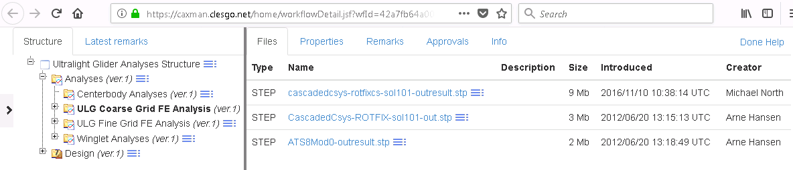
</p>

Product structure folders may have assigned user-defined property values.

<p align="center">
  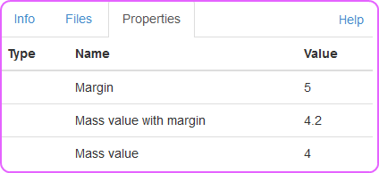
</p>

### File upload

Files can be uploaded to a server and attached to a folder.
Click  icon of your favorite node and select the "Add file" menu item from the context menu.
The following form will be shown.

<p align="center">
  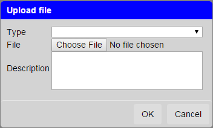
</p>

A file is selected by clicking the "Browse..." button. Select the file type from the "Type" drop-down list. The description of the file is mandatory.
Click "OK" to start upload. After a while the uploaded file will appear in the "Files" tab of the selected folder.

### Export ZIP package

The content of a folder and all children below including their documents can be exported as a ZIP package.
Click  icon of a node and select the "Download" menu item from the context menu.

### Add remark

A folder can be commented, that is, a new remark may be added.
Click  icon of a folder and select the "Add remark" menu item from the context menu.

<p align="center">
  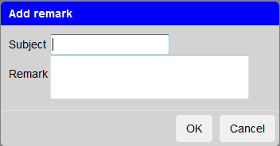
</p>

Give the subject of your remark and the remark itself. Then click "OK".

### Add approval

A folder and all its underlying content can be approved (disapproved) by adding an approval tag to the folder.
Click  icon of a folder and select the "Add approval" menu item from the context menu.

<p align="center">
  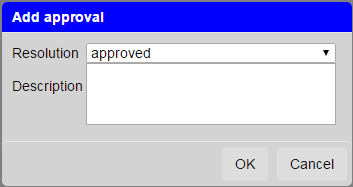
</p>

Select the resolution type (approved, rejected or not applicable) and add a description.
Then click "OK".

### Import folder (ZIP package)

A local folder and all its content (including sub folders) can be imported to a selected node. This, however, requires that the local folder has been zipped first.
Click  icon of a node and select the "Import folder" menu item from the context menu.

<p align="center">
  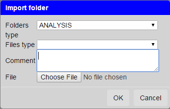
</p>

Select "Folders type" item. All imported folders will be assigned this type.
"Files types" may be empty. In this case the system will set the file type (for each file) according to the individual file extension.

### Delete folder

A folder can be deleted. That is, it can be removed from the product structure.
Click  icon of a node and select the "Delete" menu item from the context menu.

<p align="center">
  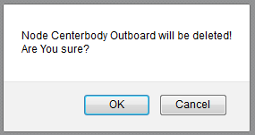
</p>

# Integrating the PLM web client in a workflow
The displayHtml service is currently registered under the following URI:
```
http://www.caxman.eu/apps/jotne/IframeDisplay.owl#displayHtml_Service
```
Use this URI to add the service to your workflow.

The following screen shot shows the minimal connections you need to make to
the PLM file chooser service block:
<p align="center">
  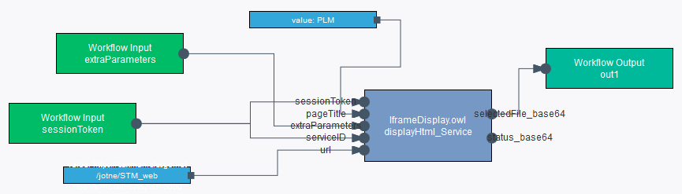
</p>

The complete set of parameters is explained in the following table:

| Parameter name | Wiring required? | Description |
| -------------- | --------- | ----------- |
| `sessionToken` | yes | The session token used for authentication. Should be connected to the workflow input with the same name |
| `serviceID` | yes | the same as sessionToken |
| `extraParameters` | yes | Contains parameters such as the GSS location, must be wired to corresponding workflow input. |
| `pageTitle` | yes | Textual caption in web browser |
| `url` | yes | URL to PLM web client. Normally it is "https://caxman.clesgo.net/jotne/STM_web/" |

The output values are explained in the following table:

| Output | Description |
| -------------- | ----------- |
| `selectedFile_base64` | GSS identifier of a selected file |
| `status_base64` | file selection status |

# File selection using the PLM web client
Workflows in CAxMan typically communicate with one of the provided cloud
storages, that is, SWIFT or the PLM Server. File interactions are typically handled
through GSS (Generic Storage Services), but this requires that the services
already know where a file shall be stored and which folder it be should
upload to. In order to provide a user friendly way to pick files and
folders that will be used in a workflow, the PLM web client may be used.

The PLM web client is meant to be used as a step in
CAxMan workflows, serving as a GUI towards the PLM storage solution offered
in the project. It also provides a user-friendly and natural way to obtain
unique GSS names which can be used as input to other services later in the
workflow chain.

Click icon  near to the file name of your interest, and context menu will appear.

<p align="center">
  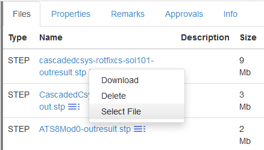
</p>

When you click "Select File" menu item, the PLM web client is closed. The service displayHtml passes the GSS identifier of the selected file to the next workflow step.
